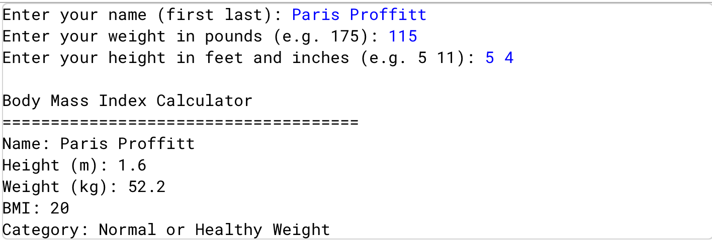

# Body Mass Index (BMI) Calculator

## Project Overview
This Java program prompts the user for their name, weight, and height, converts the units, calculates their Body Mass Index (BMI), and outputs the corresponding BMI category. It demonstrates how to process user input, perform calculations, and present results clearly.

## Skills Demonstrated
- Using variables and user input in Java (`Scanner`)  
- Performing arithmetic calculations and unit conversions  
- Applying conditional logic (`if-else`) to categorize BMI  
- Formatting output and rounding numbers for clarity  

## Concepts Applied
- Variables, data types, and input handling  
- Control flow with conditional statements  
- Arithmetic operations and rounding  
- Producing structured, readable output

## How to Run
1. Open the project in **BlueJ**.
2. Compile all classes.
3. Run the main class (`BMI`).
4. Enter the information prompted.
5. The program will display your formatted personal information, the calculated BMI, and BMI category. 

# Sample Output

## Notes
- This project was completed using **BlueJ**.
- All source code is written in **Java**.
